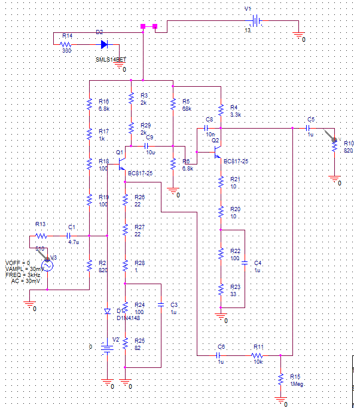
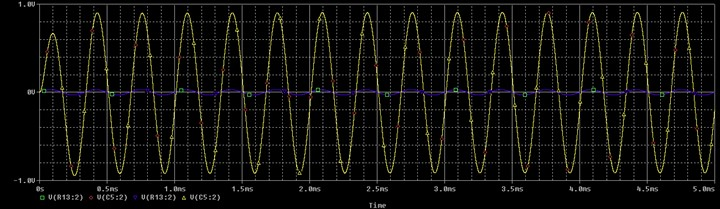

# VoltageControlledAudioPreamp
OrCAD project of Voltage Controlled Audio Preamplifier.
In the implementation of a voltage control, we have added the ability to adjust the amplification level automatically or manually via an external control voltage. This functionality is useful in applications such as audio mixers, sound processors, or compression systems in the audio industry.
The project combines elements of analog electronics and control technology, resulting in an efficient, versatile, and adaptable system based on the user's requirements.

# Description:
  • Unipolar power supply voltage (VCC = 13 V) or bipolar power supply voltage (VCC = 13 V, VEE = -VCC). Voltage presence indication with LED.
  
  • Input sinusoidal voltage with an amplitude between 0 and 30 mV.
  
  • Input signal frequency of 3 kHz.
  
  • Control DC voltage for amplification ranging from 0 to 3 V.

  • Controlled voltage amplification ranging from 1 to 30.
  
  • Load resistance of 500 + 300 = 800 Ω.

  # PCB Design
  

  # Schematic
   

 # Voltage Control
   
   
  
